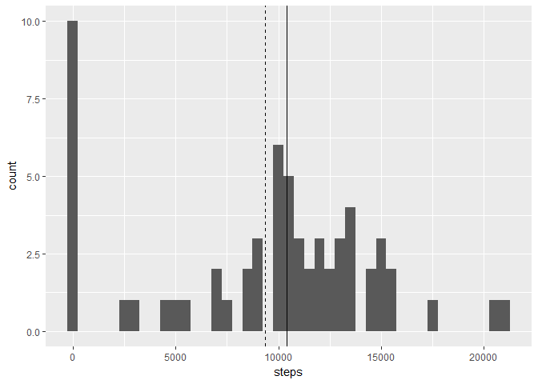
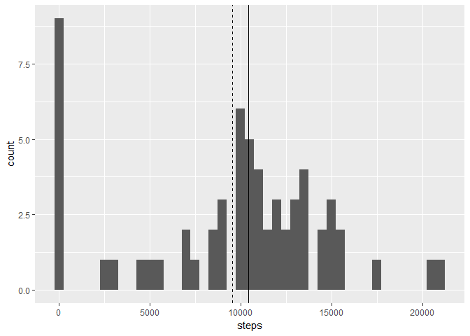
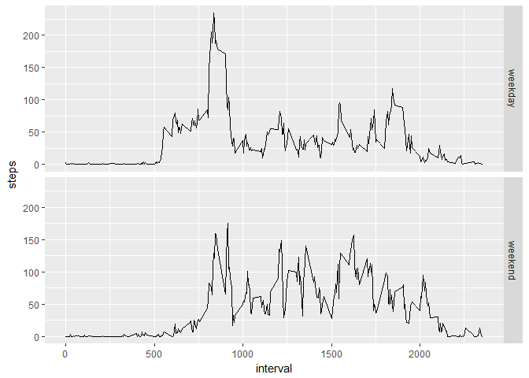

# Course Project 1


## Data loading

We load the data (csv file) into a data frame:


```r
df <- read.csv("activity.csv")
```

We start to explore some summary information for it:

```r
dim(df)
```

```
## [1] 17568     3
```


```r
str(df)
```

```
## 'data.frame':	17568 obs. of  3 variables:
##  $ steps   : int  NA NA NA NA NA NA NA NA NA NA ...
##  $ date    : Factor w/ 61 levels "2012-10-01","2012-10-02",..: 1 1 1 1 1 1 1 1 1 1 ...
##  $ interval: int  0 5 10 15 20 25 30 35 40 45 ...
```


```r
head(df)
```

```
##   steps       date interval
## 1    NA 2012-10-01        0
## 2    NA 2012-10-01        5
## 3    NA 2012-10-01       10
## 4    NA 2012-10-01       15
## 5    NA 2012-10-01       20
## 6    NA 2012-10-01       25
```

We verify that NA data have been correctly imported:

```r
sum(is.na(df$steps))
```

```
## [1] 2304
```

Finally, we create the data structures/aggregations to be used in the next steps:


```r
dailytemp <- tapply(df$steps, df$date, sum, na.rm = T)
daily <- data.frame(date = as.Date(names(dailytemp)), steps = dailytemp)

timeseriestemp <- tapply(df$steps, df$interval, mean, na.rm = T)
timeseries <- data.frame(interval = as.numeric(names(timeseriestemp)), steps = timeseriestemp)
maxts <- timeseries[timeseries$steps == max(timeseries$step),]
```

## Daily Histogram

The histogram of the daily number of steps is straightforward:


```r
require(ggplot2)
```

```
## Loading required package: ggplot2
```

```r
ggplot(daily, aes(steps)) + geom_histogram(binwidth = 500) + geom_vline(xintercept = median(daily$steps)) + geom_vline(xintercept = mean(daily$steps), lty=2)
```

<!-- -->

We see a lot of days with 0 steps. This comes from true 0 measurements (not NA) se we are fine with this values.
The median and mean values (represented in the histogram as a plain line and a dashed line) have the following values:


```r
median(daily$steps)
```

```
## [1] 10395
```

```r
mean(daily$steps)
```

```
## [1] 9354.23
```

## Time Series Plot

```r
require(ggplot2)
ggplot(timeseries, aes(interval, steps)) + geom_line()
```

<!-- -->

The 5-minute interval that, on average, contains the maximum number of steps is at 835 (206.1698113 steps on average).

## Missing data

Let's count the missing data:

```r
sum(is.na(df$steps))
```

```
## [1] 2304
```


A simple but fine missing data imputation could be replacing the missing value for a given interval with the average of the steps across the different days for the same interval.
This is better than a 'neighbor' policy since NA values seem to cluster in wide contiguous sets (so the neighbor is not 'near' anymore).
To verify that our policy is applicable let's verify that we have average data for any possible interval:


```r
sum(unique(as.numeric(df$interval)) %in% timeseries$interval) == length(unique(df$interval))
```

```
## [1] TRUE
```

Fine, we can proceed with our imputation strategy:

```r
imputed <- df
imputed$steps <- ifelse(is.na(imputed$steps), timeseries[timeseries$interval == as.numeric(imputed$interval),]$steps, imputed$steps)
```

Once we have the data frame with imputed missing values we can derive its daily values


```r
dailyimputedtemp <- tapply(imputed$steps, imputed$date, sum, na.rm = T)
dailyimputed <- data.frame(date = as.Date(names(dailyimputedtemp)), steps = dailyimputedtemp)
```


and draw the corresponding histogram:


```r
require(ggplot2)
ggplot(dailyimputed, aes(steps)) + geom_histogram(binwidth = 500) + geom_vline(xintercept = median(dailyimputed$steps)) + geom_vline(xintercept = mean(dailyimputed$steps), lty=2)
```

<!-- -->

As expected, the histogram shape is quite similar to the non-imputed one.
The median and mean values (represented in the histogram as a plain line and a dashed line) have the following values:


```r
median(dailyimputed$steps)
```

```
## [1] 10439
```

```r
mean(dailyimputed$steps)
```

```
## [1] 9530.724
```

which are slightly higher than the non-imputed counterparts. So, in average, the steps are, on average, slightly increased by the imputed data.

## Weekends

We add a column to the data frame containing a Factor indicating whether an acquisition belongs to a weekday or a weekend.


```r
Sys.setlocale("LC_TIME", "English")
```

```
## [1] "English_United States.1252"
```

```r
df$daytype <- as.factor(ifelse(weekdays(as.Date(df$date)) %in% c("Sunday", "Saturday"), "weekend", "weekday"))
```

Then we create the structure for the timeseries: 


```r
require(dplyr)
```

```
## Loading required package: dplyr
```

```
## 
## Attaching package: 'dplyr'
```

```
## The following objects are masked from 'package:stats':
## 
##     filter, lag
```

```
## The following objects are masked from 'package:base':
## 
##     intersect, setdiff, setequal, union
```

```r
weekdaysts <- with(df, aggregate(steps, list(interval, daytype), mean, na.rm=T))
colnames(weekdaysts) <- c("interval", "daytype", "steps")
```

And we draw a comparative plot:


```r
require(ggplot2)
ggplot(weekdaysts, aes(interval, steps)) + geom_line() + facet_grid(daytype~.)
```

<!-- -->
